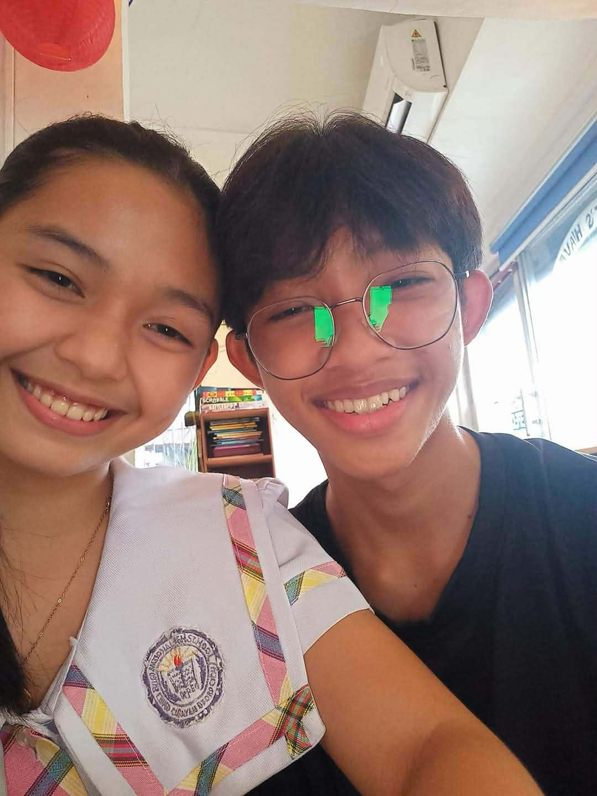
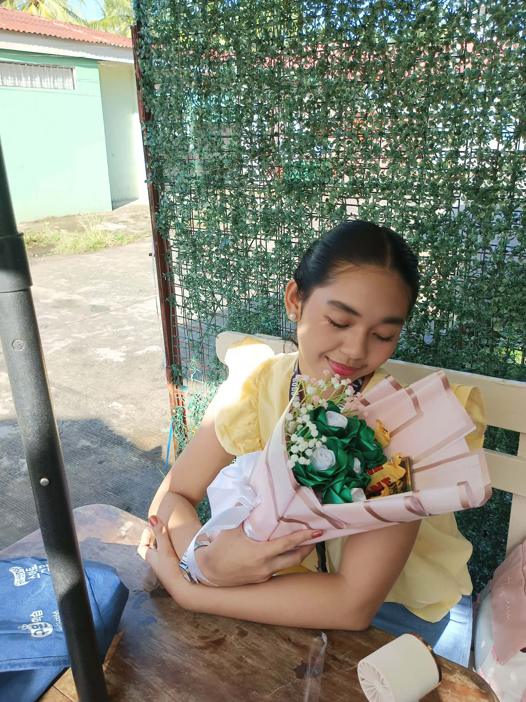

<!DOCTYPE html>
<html>
<head>
<meta charset="UTF-8">
<title>For You ❤️</title>

</head>

<body>

<!-- MUSIC -->
<audio id="bgMusic" loop>
<source src="music.mp3" type="audio/mpeg">
</audio>

<!-- POPUP -->

<h2>Click Me ❤️</h2>

I have a surprise for you 🌻

<button onclick="closePopup()">Open</button>

<!-- SURPRISE -->

🌻

<h1 id="typingText"></h1>

</body>
</html>
